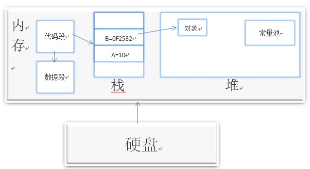

# Java基础知识

有一些基础知识是通用的，包括内存的分配等

## Java内存分配模型

首先java的程序运行在JVM(java virtual machine，java虚拟机)上，可以理解成屏蔽了操作系统的异构性，内存的分配都是在java的虚拟中执行

#### 内存区域

- 寄存器： java内部的虚拟的寄存器，存取速度快
- 栈：保存局部变量的值，包括：
  1. 用来保存基本数据类型的值；
  2. 保存类的**实例**，即堆区**对象**的引用(指针)
  3. 也可以用来保存加载方法时的帧
- **堆：**用来存放动态产生的数据，比如new出来的**对象**。
  1. 对象只包含属于各自的成员变量，并不包括成员方法
  2. 变量是私有的，方法是共享的
- **常量池**：直接常量(基本类型，String)和对其他类型、方法、字段的**符号引用(1)**，**常量池存在于堆中**
- **代码段：**用来存放从硬盘上读取的源程序代码
- **数据段：**用来存放static定义的静态成员。

### 调用示例

1. 首先找到main方法，创建了一个对象，因此在堆内存中创建了一个空间，栈中保留了一个指针
2. 定义了一个局部变量，直接保留在栈空间中
3. new了两个对象，d1和d2都在栈中保存对象的指针，对象存放在内存中
4. 函数调用结束之后，局部变量冲栈中pop出来

### C++内存分配模型

- **栈**，就是那些由编译器在需要的时候分配，在不需要的时候自动清除的变量的存储区。里面的变量通常是局部变量、函数参数等。在一个进程中，位于用户虚拟地址空间顶部的是用户栈，编译器用它来实现函数的调用。和堆一样，用户栈在程序执行期间可以动态地扩展和收缩。

- **堆**，就是那些由 new 分配的内存块，他们的释放编译器不去管，由我们的应用程序去控制，一般一个 new 就要对应一个 delete。如果程序员没有释放掉，那么在程序结束后，操作系统会自动回收。堆可以动态地扩展和收缩。

- **自由存储区**，就是那些由 malloc 等分配的内存块，他和堆是十分相似的，不过它是用 free 来结束自己的生命的。

- **全局/静态存储区**，全局变量和静态变量被分配到同一块内存中，在以前的 C 语言中，全局变量又分为初始化的和未初始化的（初始化的全局变量和静态变量在一块区域，未初始化的全局变量与静态变量在相邻的另一块区域，同时未被初始化的对象存储区可以通过 void* 来访问和操纵，程序结束后由系统自行释放），在 C++ 里面没有这个区分了，他们共同占用同一块内存区。

- **常量存储区**，这是一块比较特殊的存储区，他们里面存放的是常量，不允许修改（当然，你要通过非正当手段也可以修改，而且方法很多）

### 深拷贝VS浅拷贝

- **浅拷贝**：a对象和b对象指向了同一个内存区域
- **深拷贝**：将a的各个属性都复制到新内存里，就是深拷贝。也就是说，当b中的属性有变化的时候，a内的属性不会发生变化。

### C++多继承

多继承指一个子类能同时继承于多个父类，从而同时拥有多个父类的特征，但**缺点**是显著的。

1. 若子类继承的父类中拥有相同的成员变量，子类在引用该变量时将无法判别使用哪个父类的成员变量

2. 若一个子类继承的多个父类拥有相同方法，同时子类并未覆盖该方法（若覆盖，则直接使用子类中该方法），

那么调用该方法时将无法确定调用哪个父类的方法。

使用接口的**优点**

1. 接口定义的是过程，能执行什么操作，而不涉及状态