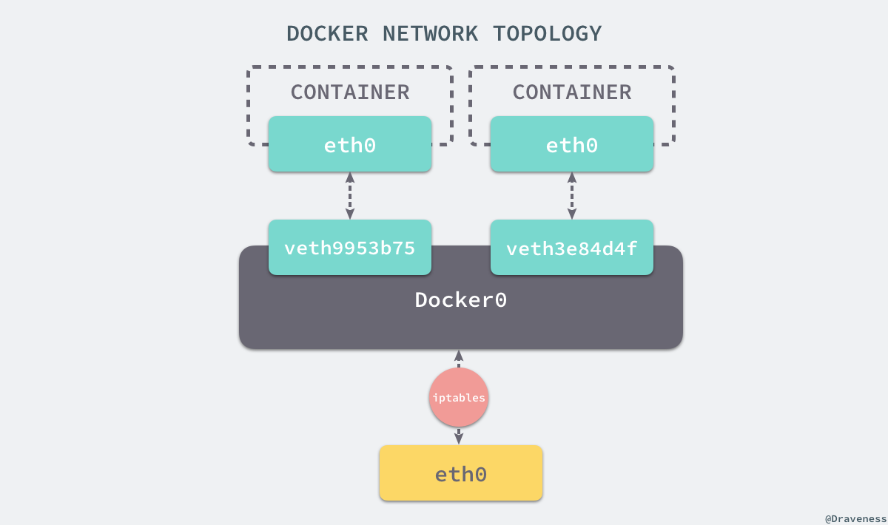
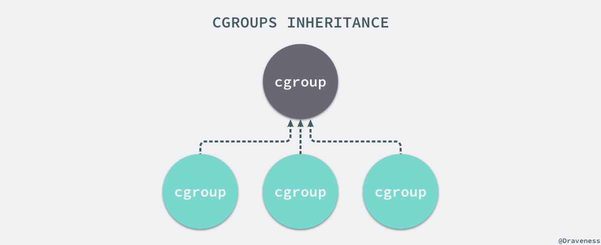

# docker机制了解

docker是用于解决后端开发和运维阶段环境不一致的问题，通过docker将程序运行时的环境也加入到版本的控制中去，排除了因为环境造成运行结果不同的问题

### Namespace

Namespace用于分离进程树，网络接口，挂载点以及进程间通信的资源，否则服务器上启动了多个服务，并且相互影响，每一个服务都能看到其他服务进程，并且访问宿主机上的任意文件

**进程隔离**

在创建的时候传入`NEWPID`使用Linux命名空间进行进程的隔离，docker容器内部的进程对宿主机的进程一无所知

**网络**

 Docker 的容器通过 Linux 的命名空间完成了与宿主机进程的网络隔离，但是却有没有办法通过宿主机的网络与整个互联网相连，就会产生很多限制

每一个使用 `docker run` 启动的容器其实都具有单独的网络命名空间，Docker 为我们提供了四种不同的网络模式，Host、Container、None 和 Bridge 模式，默认使**网桥模式**



容器在创建的时候会创建一对虚拟网卡，两个网卡会组成数据通道，一个放在容器中，一个会加入到docker0的网桥中，会为每个容器分配一个新的ip，并将docker0的ip地址设置为默认网关，docker0通过iptables与宿主机的网卡相连，由iptables转发到docker0并由网桥分配到相应的机器

**挂载点**

新的进程中创建隔离的挂载点命名空间需要在 `clone` 函数中传入 `CLONE_NEWNS`，这样子进程就能得到父进程挂载点的拷贝，容器一旦启动必须为他提供一个根文件系统(rootfs)，使用这个文件系统创建一个新的进程

### CGroups

使用命名空间隔离了文件系统，同时希望在物理资源上进行隔离，因为容器对其他容器是无感的，资源的类型包括：CPU，内存，磁盘I/O，网络

每一个CGoup都是一组被相同的标准和参数限制的进程，不同的 CGroup 之间是有层级关系的，也就是说它们之间可以从父类继承一些用于限制资源使用的标准和参数。



创建一个新的 cgroup 只需要在想要分配或者限制资源的子系统下面创建一个新的文件夹，然后这个文件夹下就会自动出现很多的内容，每一个 CGroup 下面都有一个 `tasks` 文件，其中存储着属于当前控制组的所有进程的 pid，作为负责 cpu 的子系统，`cpu.cfs_quota_us` 文件中的内容能够对 CPU 的使用作出限制

对于磁盘的IO可以直接用设备号来限速，而不需要进程号

**存储驱动**

docker中的每一个镜像都是由一系列的只读层组成的，Dockerfile中的每一个命令都会在已有的只读层上创建一个新的层，都容器运行的时候，就会在镜像的最上层加一个可写的层，因此一个镜像可以对应多个容器

### Dockerfile

分为四个部分：

- 基础镜像信息
- 维护者信息
- 镜像操作指令
- 容器启动时执行指令

具体的命令以及操作如下所示：

**RUN 运行指令命令**

```bash
RUN apt-get update\
        && apt-get install -y ....\
        && rm rf /var/cache/apt
```

**CMD 指定启动容器时的默认执行命令**

```
CMD["executable","param1","param2"]
CMD["nginx","-g","daemon off;"]
```

每个Dockerfile只能有一条CMD

**EXPOSE暴露端口**

只是指明暴露的端口信息，但是不会真正操作

**ENTRYPOINT**

指定镜像的默认入口命令，会在启动容器的时候作为根命令执行

可以使用`docker build`命令来创建镜像

```shell
docker build -t build/first ./tmp/docker_builder
```

