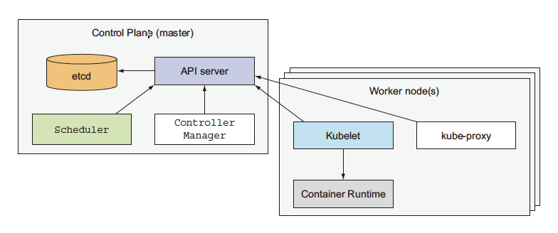

# kubernetes 分析

### 架构分析

- Master node：用于控制和管理整个kubernetes集群，一般不部署pod
- Worker node：运行、部署应用

#### The Control Plane

- API Server：用户和其他的控制模块与集群进行交互时使用
- Scheduler：用于编排应用，将应用发布到不同的节点上去
- Controller Manager：用于跟踪对象的状态，自动化的更新，出错处理等
- etcd：可靠的分布式kv系统，用于永久得储存集群的配置信息，防止重启后丢失

#### The Node

- Docker 或者其他container-runtime
- Kubelet是一个运行在宿主机上的守护进程，用于和API Server交互，查看应用是否调度到了本机上，同时也管理本机上的容器
- Kube-proxy对网络负载均衡，减小网络拥塞

### 部署流程

**启动**

- 使用kubectl 告诉 API Server 关于应用的描述
- 调度器会根据节点的资源状态和应用要求的状态计算合适的部署节点，将应用调度到相应的节点上执行
- Kubelet 周期性的从api-server获得pod的调度信息，同时会发送宿主机的健康状况

**保持容器持续运行**

- Kubernetes 会让实例的数量和你要求的一样，如果其中一个实例挂掉，kubernetes会立即自动启动一个新的实例
- 如果整个worker节点挂掉了，kubernetes会挑选一个新的节点运行