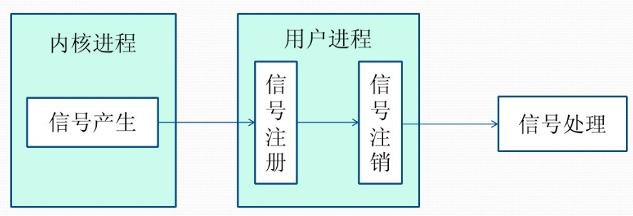
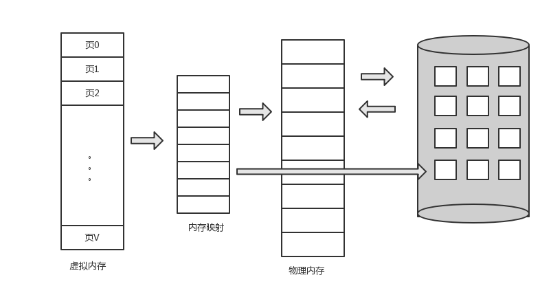
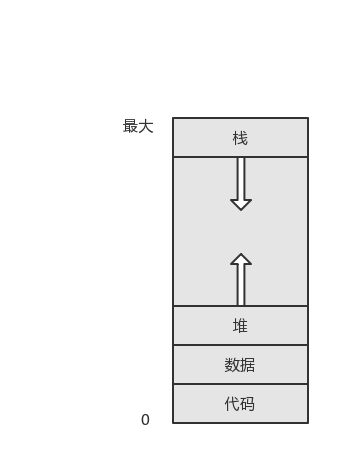
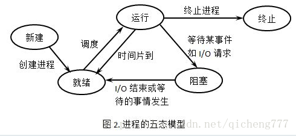

# 操作系统基础知识

### 系统调用

操作系统为了更好的管理有些资源，例如I/O等，不允许用户直接操作，而必须由操作系统来控制，而操作的入口就是系统调用（System call）

而系统调用是用户访问内核空间的唯一手段，除了异常和陷入之外，他们是内核空间的唯一合法入口

操作系统通过中断完成从用户态切换到内核态，中断号用于标识不同的中断，不同的中断有不同的处理程序，在内核中维护了一个中断向量表

#### 为什么需要系统调用

为了和用户空间上运行的进程进行交互，内核提供了一组接口，通过接口就可以访问硬件设备和操作系统的资源，主要是为了保证操作系统的稳定，防止用户程序随意调用系统命令

主要有以下三个优点：

- 它为用户空间提供了一种统一的硬件的抽象接口。比如当需要读些文件的时候，应用程序就可以不去管磁盘类型和介质，甚至不用去管文件所在的文件系统到底是哪种类型。
- 系统调用保证了系统的稳定和安全。作为硬件设备和应用程序之间的中间人，内核可以基于权限和其他一些规则对需要进行的访问进行裁决避免应用程序不正确地使用硬件设备，窃取其他进程的资源，或做出其他什么危害系统的事情
- 每个进程都运行在虚拟系统中，而在用户空间和系统的其余部分提供这样一层公共接口，如果用户随意访问硬件等资源就无法实现多任务和虚拟内存了

####基本原理

1. 用户程序为系统调用设置参数。其中一个参数是系统调用编号
2. 他们之间通过寄存器进行信息的传递，包括系统调用号以及参数
3. 参数设置完成后，程序执行“系统调用”指令。x86系统上的软中断由int产生。这个指令会导致一个异常：产生一个事件，这个事件会致使处理器切换到内核态并跳转到一个新的地址，并开始执行那里的异常处理程序

## 进程间通信IPC

每个进程各自有不同的用户地址空间，任何一个进程的全局变量在另一个进程中都看不到，所以进程之间要交换数据必须通过内核，在内核中开辟一块缓冲区，进程1把数据从用户空间拷到内核缓冲区，进程2再从内核缓冲区把数据读走

### 传统的Unix通信机制

#### 1.管道/匿名管道（pipe）

- 管道是半双工的，只能朝一个方向流动，当需要双工通信的时候，建立两个管道
- 一个进程向管道到中写的内容被另一端的进程读出，

**管道的实质**

管道的实质是一个内核缓冲区，以先进先出的方式从缓冲区存取数据

#### 2.有名管道（FIFO）

匿名管道由于没有名字，只能用于父子进程通信

有名管道以文件形式存放在文件系统中，只要可以访问路径就可以通过有名管道进行彼此通信

有名管道的名字放在文件系统中，内容放在内存中

#### 3.信号（Signal）

- 信号可以在任何时候发给另一个进程，而不需要知道进程的状态

- 如果当前进程处于未执行状态，就通过内核保存起来，直到进程恢复执行
- 如果一个信号被进程设置为阻塞，则该信号的传递被延迟，直到其阻塞被取消是才被传递给进程

##### 信号的生命周期

1. 信号由某个进程产生，并且设置了进程传递的对象（对应进程的PID），然后传递给操作系统
2. 操作系统根据进程的设置，选择性的发送给接受者，如果选择阻塞，操作系统暂时保留信号，如果进程退出就丢弃信号，否则就向这个进程传递
3. 目标进程收到之后按照信号设置的预处理的方式处理，中断，保留上下文，转到中断处理的服务进程，执行完成之后回到中断的位置

#### 4.消息队列(Message Queue)

- 消息队列是存放在内核中的消息链表，每个消息队列由消息队列标识符表示
- 消息队列存放在内核中，只有在内核中存放
- 消息队列在往里写的时候不需要另一个进程等待消息队列的到达

> **总结**
>
> 1. 消息队列是链表，有特定的格式，放在链表中
> 2. 允许一个或多个进程读写消息
> 3. 克服了信号承载信息少，缓冲区受限等缺点
> 4. 两种主要的消息队列：POSIX和SystemV

####5.共享内存（share memory）

- 使得多个进程可以直接读写同一块内存空间
- 为了多进程信息的转换，内核中专门留出了 一块内存区，访问进程把它映射到自己的私有地址空间空间中，进程读写不需要拷贝
- 多个进程共享同一段内存，需要依靠同步机制（信号量）来达到进程间的同步及互斥

#### 6.信号量

（1）**创建一个信号量**：这要求调用者指定初始值，对于二值信号量来说，它通常是1，也可是0。
（2）**等待一个信号量**：该操作会测试这个信号量的值，如果小于0，就阻塞。也称为P操作。
（3）**挂出一个信号量**：该操作将信号量的值加1，也称为V操作。

#### 7.套接字(socket)

套接字是一种通信机制，凭借这种机制，客户/服务器（即要进行通信的进程）系统的开发工作既可以在本地单机上进行，也可以跨网络进行。也就是说它可以让不在同一台计算机但通过网络连接计算机上的进程进行通信。

**套接字特性**
套接字的特性由3个属性确定，它们分别是：域、端口号、协议类型。

一种是**AF_INET，它指的是Internet网络**，IP地址和端口来指定一台联网机器上的某个特定服务

另一种是**AF_UNIX，表示UNIX文件系统**，就是文件输入/输出，而它的地址就是文件名。

## IO复用

通过一种机制，一个进程可以监视多个描述符，一旦描述符就绪（读就绪或者写就绪），能够通知程序进行相应的读写操作，这些读写操作都是阻塞的

对比多线程技术，I/O复用技术最大的优势最大的优势就是系统的开销小，系统不必为其创建进程/线程，系统的开销小，不必维护这些线程

#### select简介

1. select使用数组存储文件描述符，因此单个进程能够监控的文件描述符有最大数量有限制，一般为2048

2. 对socket的扫描是线性的，采用轮训的办法，效率低
3. 如果能够给套接字注册一个回调函数，活跃的时候通知，完成相应的操作，就能够避免轮训
4. 维护了一个数据结构存放fd，使得内核空间和用户空间传递该结构的时候开销比较大

####poll简介

poll与select类似，只不过使用链表来存储文件描述符，没有最大链接数量限制

同样也是通过遍历的方式，效率低

#### epoll简介

1. epoll使用一个文件描述符管理多个描述符，将用户关系的文件描述符的事件存放到内核的一个事件表中，这样在用户空间和内核空间的copy只需一次
2. 使用事件的方式进行通知，通过注册fd，一旦就绪就使用回调的放置激活fd

分为水平触发和边缘触发两种：

**水平触发通知：**

如果文件描述符上可以非阻塞地执行I/O系统调用，此时认为它已经就绪，触发通知。 

 这一次不处理，下一次还是会触发通知

**边沿触发通知：**

如果文件描述符自上次状态检查以来有了新的I/O活动(比如新的输入)，此时需要触发通知

此时不立即处理该事件，当下次再调用epoll监听时，虽然该文件描述符的状态是可读的，但是此时epoll并不会再给应用程序发送通知。因为在边沿触发工作模式下，只有下一个新的I/O事件到来时，才会再次发送通知​     

**优点**

1. 没有最大的并发链接限制
2. 效率提升，不是采用轮询的方式，不会因为fd的数量增加而导致效率下降

#### 总结

1. 表面上看epoll的性能最好，`但是在连接数少并且连接都十分活跃的情况下，select和poll的性能可能比epoll好`，毕竟epoll的通知机制需要很多函数回调。
2. `select低效是因为每次它都需要轮询`。但低效也是相对的，视情况而定，也可通过良好的设计改善。

## 操作系统—虚拟内存

**虚拟内存技术允许执行进程不必完全在内存中，这种方案的一个显著的优点就是程序可以比物理内存大，而且，虚拟内存将内存抽象成一个巨大的，同统一的存储数组，进而将用户看到的逻辑内存与物理内存分开，这种技术允许程序员不受内存存储的限制，虚拟内存页允许进程很容易的共享文件和地址空间**

#### 虚拟内存

虚拟内存将用户的逻辑和物理的内存分开，使得用户无需担心物理上的放置

#### 进程的虚拟空间

进程的虚拟地址空间就是进程如何在内存中存放的逻辑(或虚拟)试图，通常，该视图为进程从某一逻辑地址(如地址0)开始，连续存放，如图:

堆可向上生长，类似的，还允许随着子程序的不断调用，栈可以向下生长，堆与栈之间的巨大空白空间(或洞)为虚拟地址的一部分,只有堆和栈生长的时候才需要分配实际的物理页

优点：

- 共享对象映射到虚拟地址空间，系统库可为多个进程只读的方式共享，虽然每个进程都认为共享库是其虚拟地址空间的一部分，而共享库所用的物理内存的实际页是为所有的进程所共享

- 两个或多个进程之间可以通过共享内存来通信，虚拟内存允许一个进程创建内存区域，以便与其他进程进行共享，共享该内存区域的进程认为它是其虚拟地址空间的一部分。而事实上这部分是共享的

#### 如何调度

- 按需要时才调入相应的页，这种技术称为**按需调页(demand paging)**,常为虚拟内存系统所采用。对于按需调页虚拟内存，只有程序执行需要时才载入页，那些从未访问的页不会调入到物理内存。

#### 总结

因此，一些地址在虚拟空间上是连续的，而在物理空间上不一定是连续的，可能跨页了

### 多线程数据空间

#### 共享

- 堆  由于堆是在进程空间中开辟出来的

- 全局变量 它是与具体某一函数无关的，所以也与特定线程无关；因此也是共享的

-  静态变量 虽然对于局部变量来说，它在代码中是“放”在某一函数中的，但是其存放位置和全局变量一样，存于堆中开辟的.bss和.data段，是共享的

- 文件等公用资源  这个是共享的，使用这些公共资源的线程必须同步。

#### 独享

- 栈 栈是独享的

- 寄存器  这个可能会误解，因为电脑的寄存器是物理的，每个线程去取值难道不一样吗？其实线程里存放的是副本，包括程序计数器PC

## **new和malloc的区别**

**a.属性**

　　new/delete是C++关键字，需要编译器支持。malloc/free是库函数，需要头文件支持c。

**b.参数**

　　使用new操作符申请内存分配时无须指定内存块的大小，编译器会根据类型信息自行计算。而malloc则需要显式地指出所需内存的尺寸。

**c.返回类型**

　　new操作符内存分配成功时，返回的是对象类型的指针，类型严格与对象匹配，无须进行类型转换，故new是符合类型安全性的操作符。而malloc内存分配成功则是返回void * ，需要通过强制类型转换将void*指针转换成我们需要的类型。

**e. 分配失败**

　　new内存分配失败时，会抛出bac_alloc异常。malloc分配内存失败时返回NULL。

**f.自定义类型**

​         new会先调用operator new函数，申请足够的内存（通常底层使用malloc实现）。然后调用类型的构造函数，初始化成员变量，最后返回自定义类型指针。delete先调用析构函数，然后调用operator delete函数释放内存（通常底层使用free实现）。

​         malloc/free是库函数，只能动态的申请和释放内存，无法强制要求其做自定义类型对象构造和析构工作。

**g.重载**

　　C++允许重载new/delete操作符，特别的，布局new的就不需要为对象分配内存，而是指定了一个地址作为内存起始区域，new在这段内存上为对象调用构造函数完成初始化工作，并返回此地址。而malloc不允许重载。

**h.内存区域**

　　new操作符从自由存储区（free store）上为对象动态分配内存空间，而malloc函数从堆上动态分配内存。自由存储区是C++基于new操作符的一个抽象概念，凡是通过new操作符进行内存申请，该内存即为自由存储区。而堆是操作系统中的术语，是操作系统所维护的一块特殊内存，用于程序的内存动态分配，C语言使用malloc从堆上分配内存，使用free释放已分配的对应内存。自由存储区不等于堆，如上所述，布局new就可以不位于堆中。

## Java内存分配模型

首先java的程序运行在JVM(java virtual machine，java虚拟机)上，可以理解成屏蔽了操作系统的异构性，内存的分配都是在java的虚拟中执行

#### 内存区域

- 寄存器： java内部的虚拟的寄存器，存取速度快
- 栈：保存局部变量的值，包括：
  1. 用来保存基本数据类型的值；
  2. 保存类的**实例**，即堆区**对象**的引用(指针)
  3. 也可以用来保存加载方法时的帧
- **堆：**用来存放动态产生的数据，比如new出来的**对象**。
  1. 对象只包含属于各自的成员变量，并不包括成员方法
  2. 变量是私有的，方法是共享的
- **常量池**：直接常量(基本类型，String)和对其他类型、方法、字段的**符号引用(1)**，**常量池存在于堆中**
- **代码段：**用来存放从硬盘上读取的源程序代码
- **数据段：**用来存放static定义的静态成员。

### 调用示例

1. 首先找到main方法，创建了一个对象，因此在堆内存中创建了一个空间，栈中保留了一个指针
2. 定义了一个局部变量，直接保留在栈空间中
3. new了两个对象，d1和d2都在栈中保存对象的指针，对象存放在内存中
4. 函数调用结束之后，局部变量冲栈中pop出来

### C++内存分配模型

- **栈**，就是那些由编译器在需要的时候分配，在不需要的时候自动清除的变量的存储区。里面的变量通常是局部变量、函数参数等。在一个进程中，位于用户虚拟地址空间顶部的是用户栈，编译器用它来实现函数的调用。和堆一样，用户栈在程序执行期间可以动态地扩展和收缩。
- **堆**，就是那些由 new 分配的内存块，他们的释放编译器不去管，由我们的应用程序去控制，一般一个 new 就要对应一个 delete。如果程序员没有释放掉，那么在程序结束后，操作系统会自动回收。堆可以动态地扩展和收缩。
- **自由存储区**，就是那些由 malloc 等分配的内存块，他和堆是十分相似的，不过它是用 free 来结束自己的生命的。
- **全局/静态存储区**，全局变量和静态变量被分配到同一块内存中，在以前的 C 语言中，全局变量又分为初始化的和未初始化的（初始化的全局变量和静态变量在一块区域，未初始化的全局变量与静态变量在相邻的另一块区域，同时未被初始化的对象存储区可以通过 void* 来访问和操纵，程序结束后由系统自行释放），在 C++ 里面没有这个区分了，他们共同占用同一块内存区。
- **常量存储区**，这是一块比较特殊的存储区，他们里面存放的是常量，不允许修改（当然，你要通过非正当手段也可以修改，而且方法很多）

### 深拷贝VS浅拷贝

- **浅拷贝**：a对象和b对象指向了同一个内存区域
- **深拷贝**：将a的各个属性都复制到新内存里，就是深拷贝。也就是说，当b中的属性有变化的时候，a内的属性不会发生变化。

### C++多继承

多继承指一个子类能同时继承于多个父类，从而同时拥有多个父类的特征，但**缺点**是显著的。

1. 若子类继承的父类中拥有相同的成员变量，子类在引用该变量时将无法判别使用哪个父类的成员变量
2. 若一个子类继承的多个父类拥有相同方法，同时子类并未覆盖该方法（若覆盖，则直接使用子类中该方法），

那么调用该方法时将无法确定调用哪个父类的方法。

使用接口的**优点**

1. 接口定义的是过程，能执行什么操作，而不涉及状态

### 线程和进程各自有什么区别和优劣呢？

- 进程是资源分配的最小单位，线程是程序执行的最小单位。
- 进程有自己的独立地址空间，每启动一个进程，系统就会为它分配地址空间，建立数据表来维护代码段、堆栈段和数据段，这种操作非常昂贵。而线程是共享进程中的数据的，使用相同的地址空间，因此CPU切换一个线程的花费远比进程要小很多，同时创建一个线程的开销也比进程要小很多。
- 线程之间的通信更方便，同一进程下的线程共享全局变量、静态变量等数据，而进程之间的通信需要以通信的方式（IPC)进行。不过如何处理好同步与互斥是编写多线程程序的难点。
- 但是多进程程序更健壮，多线程程序只要有一个线程死掉，整个进程也死掉了，而一个进程死掉并不会对另外一个进程造成影响，因为进程有自己独立的地址空间。

## mmap VS 常规文件读写

### 文件操作

1. 进程发起读文件请求
2. 内核通过查找进程文件符表，定位到内核已打开文件集上的文件信息，从而找到此文件的inode。
3. 如果存在，就直接返回页面的内容
4. 否则通过inode找到磁盘地址，把数据读到页缓存中，再次发起读页请求，再将页数据发送到用户进程空间中

**总结**

1. 常规文件操作为了提高读写效率和保护磁盘，使用了页缓存机制
2. 读文件时需要先将文件页从磁盘拷贝到页缓存中，由于页缓存处在内核空间，不能被用户进程直接寻址，所以还需要将页缓存中数据页再次拷贝到内存对应的用户空间中，有了两次拷贝的过程

### map(内存文件映射)

1. mmap操作文件中，创建新的虚拟内存区域和建立文件磁盘地址和虚拟内存区域映射这两步，没有任何文件拷贝操作
2. 如果发现内存中没有数据，就发生缺页异常，只有一次拷贝就将磁盘中的数据传入用户的空间中

**对比**

**常规文件操作需要从磁盘到页缓存再到用户主存的两次数据拷贝。而mmap操控文件，只需要从磁盘到用户主存的一次数据拷贝过程**

## 进程模型

1. 用户创建完进程之后，获取了所有的资源进入就绪状态，在时间片到达的时候调度进入运行状态
2. 时间片结束，进入就绪状态，等待下一次的调度
3. 如果需要等待什么或者进行I/O，进入阻塞状态，让出CPU，当完成之后进入就绪状态，等待被调度到CPU上继续运行