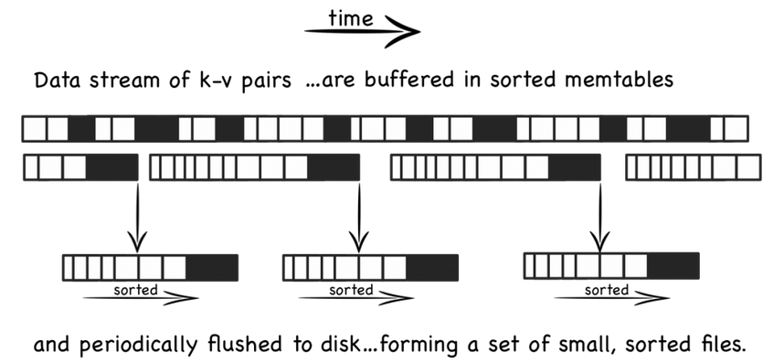

## 二叉树

#### 前序遍历——非递归

> 使用栈的方式

1. 在压入栈的时候就打印，然后先压入左节点
2. 如果左子树为空了，就弹出栈顶节点，当前节点为它的右子树

```c++
void preOrder(TreeNode *root) {
    TreeNode * p = root;
    stack<TreeNode*>s;
    while(!s.empty() || p != NULL) {
        while(p!=NULL) {
            s.push(p);
            cout << p->val << endl;
            p = p->left;
        }
        if(!s.empty()) {
            p = s.top();
            s.pop();
            p = p->right;
        }
    }
}
```

#### 中序遍历——非递归

1. 同样也是把左子树先压入栈中
2. 如果左子树为空了，就把当前节点打印出来，并且再把当前节点变为该节点的右子树，压入栈中

```c++
void midOrder(TreeNode *root) {
    stack<TreeNode*> s;
    TreeNode *p = root;
    while(!s.empty() || p!= NULL) {
        while(p!= NULL) {
            s.push(p);
            p = p->left;
        }
        if(!s.empty()) {
            p = s.top();
            s.pop();
            cout << p->val << endl;
            p = p->right;
        }
    }
}
```

#### 后序遍历——非递归

> 思路1

1. 同样也是使用栈，先把左子树压入栈中
2. 如果这个节点没有被访问过，就重新压栈中，当前节点变成该节点的右子树
3. 否则，就打印出来，并且不再把节点压入，因此吧当前节点设置为NULL

```c++
void postOrder(TreeNode *root) {
    stack<TreeNode*>s;
    TreeNode *p = root;
    while(!s.empty() || p != NULL) {
        while(p != NULL) {
            s.push(p);
            p = p->left;
        }
        if(!s.empty()) {
            TreeNode *t = s.top();
            s.pop();
            if(!t->isVisit) {
                t->isVisit = true;
                s.push(t);
                p = t->right;
            }else{
                cout << t->val << endl;
                p = NULL;
            }
        }
    }
}
```

> 思路2

1. 如果这个节点没有左右子树，或者都被访问过了，那就可以打印
2. 否则把右子树压入
3. 最后把左子树压入

```c++
void postOrder2(TreeNode *root)     //非递归后序遍历
{
    stack<TreeNode*> s;
    TreeNode *cur;                      //当前结点
    TreeNode *pre=NULL;                 //前一次访问的结点
    s.push(root);
    while(!s.empty()) {
        cur=s.top();
        if((cur->left==NULL&&cur->right==NULL)||
           (pre!=NULL&&(pre==cur->left||pre==cur->right))) {
            cout<<cur->val<<"";  //如果当前结点没有孩子结点或者孩子节点都已被访问过
            s.pop();
            pre=cur;
        }
        else {
            if(cur->right!=NULL)
                s.push(cur->right);
            if(cur->left!=NULL)
                s.push(cur->left);
        }
    }
}
```

## 各种树的总结

#### AVL树

AVL树是二叉搜索树的鼻祖，平衡度也是最好的，高度差小于1，它的查询时间复杂度可以保证是O（log n），之所以平时不用，是因为维护高度的平衡的代价比从中获取的收益大多了

#### 红黑树

确保没有一条从根到叶子节点的路径是其他路经的两倍，也是一种平衡二叉树，平衡性没有AVL树好，

#### B树

N叉平衡树，每个节点可以有更多的孩子，新的值可以插到已有的节点里，而不需要改变高度，减少了重新平衡和数据迁移的次数

#### B+树

中间节点不存储数据，只有几个关键值，所有的键和值的指针都在叶子节点上

#### 总结

针对内存操作，优先使用红黑树，而针对磁盘的操作，有限考虑B/B+树，可以加载树的一个页进行操作。

AVL树、红黑树，适合小范围数据场景，对于map这些来说查询得更快，而B树读进来的是一个范围，范围非常大，树的层数小，磁盘IO的次数就比较少

红黑树更加适用于内部存储，而且现有的hashMap实现是在hash冲突超过8个后才会将链表结构转化成红黑树，红黑树会将冲突后的链表的索引复杂度由O(N)降低到O(logN)，极端冲突的条件下多用于内部排序的红黑树可以大幅度提升性能

## LSM-Tree

**LSM Tree存储结构**

LSM tree存储实现思路与以上四种措施不太相同，其将随机写转化为顺序写，尽量保持日志型数据库的写性能优势，并提供相对较好的读性能。具体实现方式如下：

1. 当有写操作(或update操作)时，写入位于内存的buffer，内存中通过某种数据结构(如skiplist)保持key有序

2. 一般的实现也会将数据追加写到磁盘Log文件，以备必要时恢复

3. 内存中的数据定时或按固定大小地刷到磁盘，更新操作只不断地写到内存，并不更新磁盘上已有文件

4. 随着越来越多写操作，磁盘上积累的文件也越来越多，这些文件不可写且有序

5. 定时对文件进行合并操作(compaction)，消除冗余数据，减少文件数量



#### 特性

1. 写操作都写进内存中，更新内存，内存中的数据以块的形式刷到磁盘中，定期执行合并操作，减少磁盘IO
2. 先从内存数据开始访问，如果在内存中访问不到，再顺序从一个个磁盘文件中查找，由于文件本身有序，并且定期的合并减少了磁盘文件个数，因而查找过程相对较快速
3. 生成第N层的时候，对N-1层的数据进行排序，使得每层内的数据文件之间都是有序的


## 各种排序算法

### 归并排序

```c++
void merge(vector<int> &unsorted,int first, int mid, int last, vector<int>& sorted) {
    int i = first;
    int j = mid;
    int k = 0;
    while(i < mid && j < last) {
        if(unsorted[i] < unsorted[j]){
            sorted[k++] = unsorted[i++];
        } else {
            sorted[k++] = unsorted[j++];
        }
    }
    while(i < mid) {
        sorted[k++] = unsorted[i++];
    }
    while(j < last) {
        sorted[k++] = unsorted[j++];
    }
    for(int v = 0; v < k; v++) {
        unsorted[first+v] = sorted[v];
        cout << sorted[v] << "\t";
    }
    cout << endl;
}

void merge_sort(vector<int> &unsorted,int first, int last, vector<int>& sorted){
    if(first < last -1) {
        int mid = (first + last) / 2;
        merge_sort(unsorted,first,mid,sorted);
        merge_sort(unsorted,mid,last,sorted);
        merge(unsorted,first,mid,last,sorted);
    }
}
```


