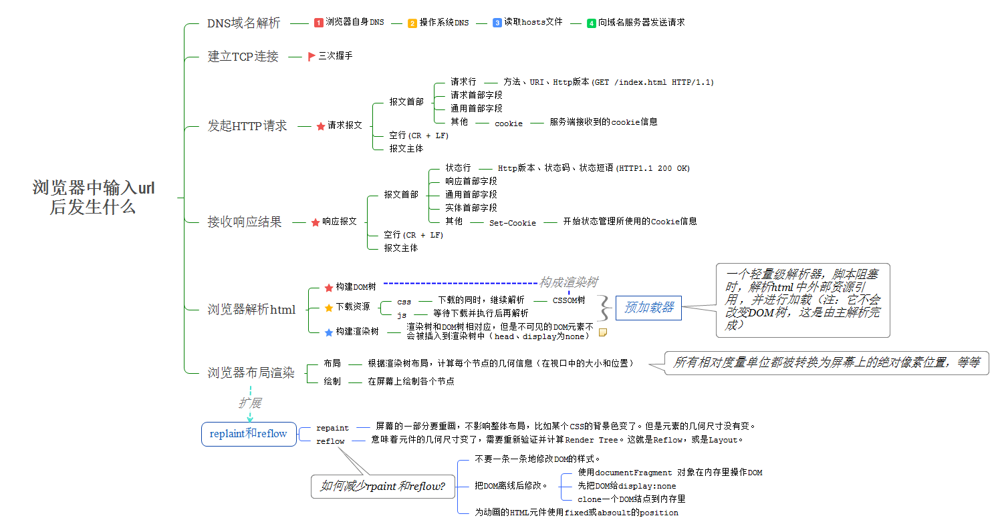

# 计算机网络基础知识

### HTTPS工作原理

1. **客户端发起HTTPS请求**：连接到server的443端口
2. **服务端的配置**：需要有证书，可以自己制作或者找受信任的公司，证书就是一对公钥和私钥
3. **传送证书**：公钥，只是包含了很多信息，如证书的颁发机构，过期时间等等。
4. **客户端解析证书**：验证证书的信息，生成一个随机值，然后用证书对该随机值进行加密
5. **传送加密信息**：用证书加密后的随机值，目的就是让服务端得到这个随机值
6. **服务段解密信息**：服务端用私钥解密后，得到了客户端传过来的随机值(私钥)
7. **传输加密后的信息**：服务端用私钥加密信息，
8. **客户端解密信息**客户端用之前生成的私钥解密服务段传过来的信息，于是获取了解密后的内容

## TCP 协议如何保证可靠传输

1. 应用数据被分割成 TCP 认为最适合发送的数据块。
2. TCP 给发送的每一个包进行编号，接收方对数据包进行排序，把有序数据传送给应用层。
3. **校验和：** TCP 将保持它首部和数据的检验和。这是一个端到端的检验和，目的是检测数据在传输过程中的任何变化。如果收到段的检验和有差错，TCP 将丢弃这个报文段和不确认收到此报文段。
4. TCP 的接收端会丢弃重复的数据。
5. **流量控制：** TCP 连接的每一方都有固定大小的缓冲空间，TCP的接收端只允许发送端发送接收端缓冲区能接纳的数据。当接收方来不及处理发送方的数据，能提示发送方降低发送的速率，防止包丢失。TCP 使用的流量控制协议是可变大小的滑动窗口协议。 （TCP 利用滑动窗口实现流量控制）
6. **拥塞控制：** 当网络拥塞时，减少数据的发送。
7. **停止等待协议** 也是为了实现可靠传输的，它的基本原理就是每发完一个分组就停止发送，等待对方确认。在收到确认后再发下一个分组。
8. **超时重传：** 当 TCP 发出一个段后，它启动一个定时器，等待目的端确认收到这个报文段。如果不能及时收到一个确认，将重发这个报文段。

## 常见的HTTP相应状态码

- 200：请求被正常处理

- 204：请求被受理但没有资源可以返回

- 206：客户端只是请求资源的一部分，服务器只对请求的部分资源执行GET方法，相应报文中通过Content-Range指定范围的资源。

- 301：永久性重定向

- 302：临时重定向

- 303：与302状态码有相似功能，只是它希望客户端在请求一个URI的时候，能通过GET方法重定向到另一个URI上

- 304：发送附带条件的请求时，条件不满足时返回，与重定向无关

- 307：临时重定向，与302类似，只是强制要求使用POST方法

- 400：请求报文语法有误，服务器无法识别

- 401：请求需要认证

- 403：请求的对应资源禁止被访问

- 404：服务器无法找到对应资源

- 500：服务器内部错误

- 503：服务器正忙

## GET VS POST

GET参数通过url传递，POST放在request body中。

GET请求在url中传递的参数是有长度限制的，而POST没有。

GET在浏览器回退时是无害的，POST会再次提交请求。

GET产生的URL地址可以被Bookmark，而POST不可以。

GET请求会被浏览器主动cache，而POST不会，除非手动设置。

GET请求只能进行url编码，而POST支持多种编码方式。

GET请求参数会被完整保留在浏览器历史记录里，而POST中的参数不会被保留。

GET只接受ASCII字符的参数的数据类型，而POST没有限制

## 浏览器中输入URL后发生什么

